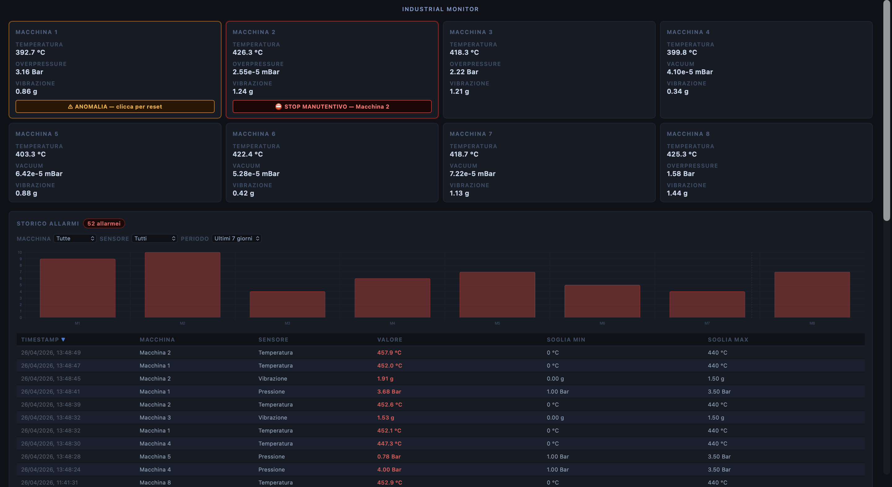

# Industrial Monitor Dashboard

Real-time monitoring dashboard for industrial wire bonding machines, built with Python Flask and Chart.js.

## Overview

Industrial Monitor simulates and visualizes sensor data from 8 machines in real time, with an alarm system and historical alarm logging. Designed to replicate the kind of monitoring tools used in semiconductor manufacturing environments.

## Features

- **Real-time dashboard** — 8 machine cards updated every 2 seconds
- **Multi-sensor monitoring** — Temperature (°C), Vacuum (mBar), Overpressure (Bar), Vibration (g)
- **Alarm system** — per-machine alarm logic with warning and maintenance stop states
- **Focus mode** — click any machine to view its full sensor history chart
- **Interactive chart** — pause on hover, crosshair, tooltip with real values
- **Alarm history** — SQLite database with filterable table and bar chart
- **Retention policy** — automatic cleanup of records older than 7 days

## Tech Stack

- **Backend:** Python, Flask, SQLite
- **Frontend:** HTML, CSS, JavaScript, Chart.js
- **Architecture:** REST API + polling frontend

## How to Run

```bash
pip3 install flask
python3 app.py
```

Then open `http://127.0.0.1:5000` in your browser.

## Background

This project was built as a learning exercise to apply Python and web development skills in a domain I know well — industrial machine maintenance in semiconductor manufacturing.
